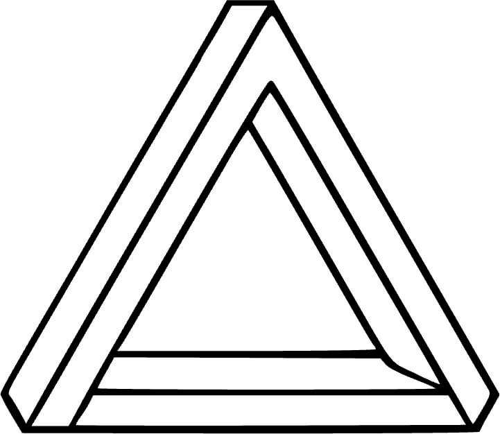

   
  PrediX

 

# Senior AI Scientist & Deep Learning Consultant

## The Company

PrediX is a medical AI startup developing an AI-driven virtual biopsy
platform to transform cancer care through faster, more precise, and less
invasive diagnostics.

Current cancer diagnosis often relies on invasive, slow, and costly
procedures that can delay treatment decisions. PrediX is developing
proprietary multimodal AI algorithms to support rapid, non-invasive,
biology-informed diagnostics from detection and triage to diagnosis,
treatment planning, and follow-up.

## The Role

We are seeking an experienced AI architecture and deep learning
consultant to support our R&D team in developing advanced multimodal AI
architectures for PathoRadiomics, at the intersection of radiology,
digital pathology, and oncology AI.

The role combines strategic architecture guidance with hands-on deep
learning work, including model design, pre-training, contrastive
learning, and cross-modal alignment.

The ideal consultant is a senior AI scientist or architect who has led
complex deep-learning initiatives from scientific concept to working
prototype or product-oriented implementation. This person should combine
scientific depth with practical judgment, challenge assumptions, propose
architecture alternatives and, and help de-risk key technical decisions
in close collaboration with the R&D team.

## Key Responsibilities

- Define and refine multimodal PathoRadiomics model architectures.
- Advise on model families, representation learning, pre-training, and
  prediction heads.
- Design and review deep learning architectures for radiology and
  digital pathology data.
- Advise on the selection and adaptation of state-of-the-art deep
  learning approaches for computer vision, representation learning, and
  multimodal model development.
- Review and contribute to code, model implementations, training loops,
  and experimental design.
- Provide senior-level advice on experimental strategy, validation
  design, benchmarking standards, and reproducibility.
- Support research directions for publications, grants, patents, and
  investor-facing technical materials.

## Required Qualifications

- 10+ years of experience in machine learning, deep learning, computer
  vision, or related AI fields.

- Strong scientific and technical background, demonstrated through
  publications, patents, deployed AI systems, or leadership of complex
  AI projects.

- Advanced degree in Computer Science, Electrical Engineering,
  Biomedical Engineering, Applied Mathematics, or a related field is
  preferred (PhD or equivalent senior-level research or industrial
  experience).

- Deep expertise in computer vision and representation learning,
  including CNNs, Vision Transformers, attention mechanisms, foundation
  models, contrastive learning, self-supervised learning, or multimodal
  learning.

- Proven experience applying advanced AI methods to complex real-world
  domains.

- Ability to move between high-level architecture design, experimental
  strategy, and hands-on implementation.

- Excellent communication skills and ability to work with a
  multidisciplinary R&D team.

## Scope and Engagement

- Part-time consulting role: approximately 1-2 days per week.
- Flexible structure: hybrid, or periodic technical sessions.
- Expected involvement: architecture reviews, hands-on contribution,
  mentoring, experiment design, and senior technical advice on model
  architecture and validation strategy.

 

### How to Apply

Email your CV to [**jobs@predix-ai.com**](mailto:jobs@predix-ai.com).
